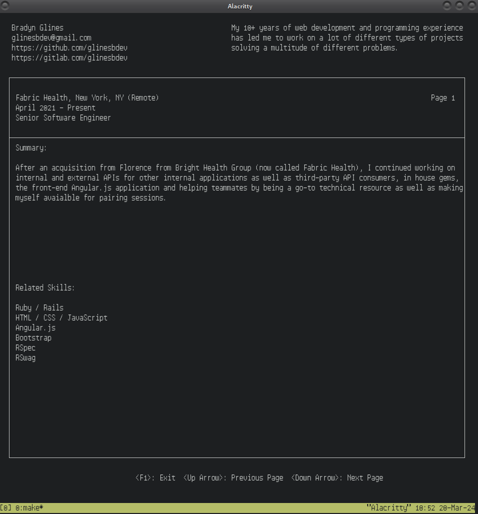

# Python NCurses Resume

## Running the Project

Download this repository and run the `make` command. You must have `make` installed on your system.
Alternatively, the `python3` binary can be used from the root of the project `python3 src`.
